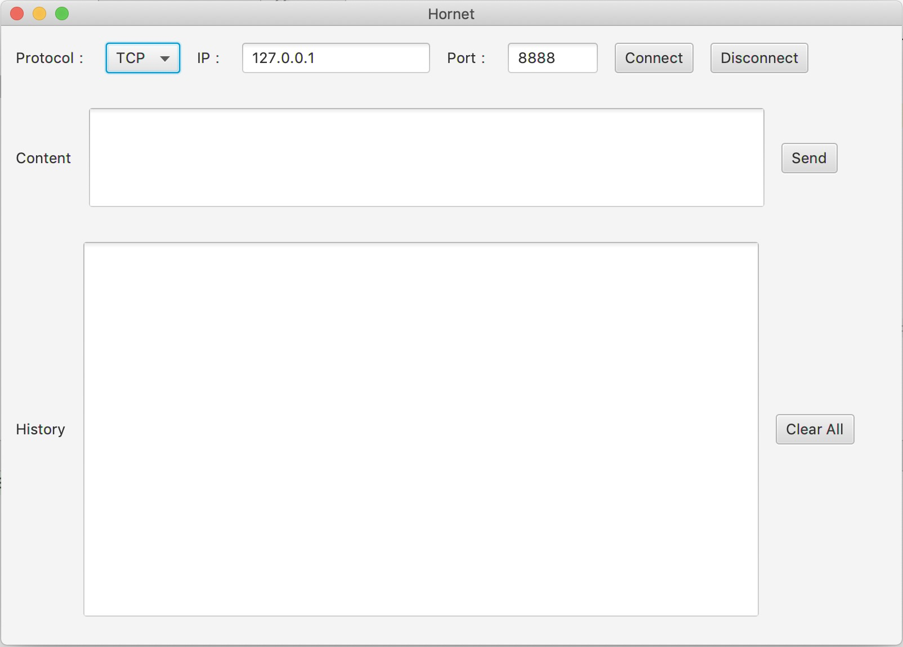

# Hornet

## What is Hornet?
The Hornet is a TCP(Socket) tool, you can use it to establish TCP connections, send messages and get the server's response.

Hornet是一个TCP（基于Socket）工具，使用它可以建立TCP连接，发送消息，并获得返回结果。

## What does it look like?

## Build and Run

### Requirements

- Maven 3.5 (older versions might work too);
- Java Developer Kit 8 with at least Update 40;

构建该项目所需环境：Maven3.5以上版本，JDK8（支持JavaFx）以上版本。

### OS-specific requirements

- (Windows) EXE installers: Inno Setup
- (Windows) MSI installers: WiX (at least version 3.7)
- (Linux) DEB installers: dpkg-deb
- (Linux) RPM installers: rpmbuild
- (Mac) DMG installers: hdiutil
- (Mac) PKG installers: pkgbuild

### Build

#### run it with jar

call "mvn clean package". Then call "java -jar hornet-1.0-SNAPSHOT.jar" to run it.

执行"mvn clean package"打成jar包，然后通过"java -jar hornet-1.0-SNAPSHOT.jar"即可执行。

#### run it in native

To create your executable file with JavaFX-magic, call mvn jfx:jar. The jar-file will be placed at target/jfx/app.

执行"mvn jfx:jar"，创建适合本地系统的jar包，生成的jar包位于"target/jfx/app"目录下。

To create your executable file with JavaFX-magic and some installers (please see official oracle-documentation which applications are required for this),
 call mvn jfx:native. The native launchers or installers will be placed at target/jfx/native.

执行"mvn jfx:native"，将项目打成当前系统可执行的文件，比如Windows的exe，Mac的pkg或可直接执行的app。

## Contract Me

WeChat（微信号）：541075754

个人公众号：程序新视界

